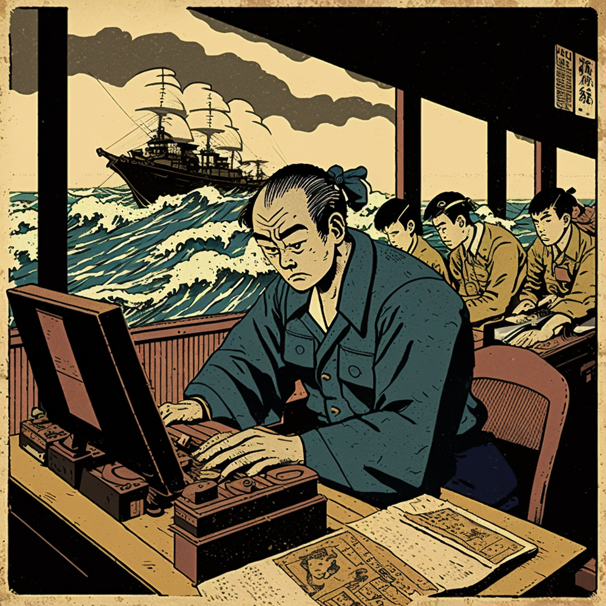

Good startup leaders absorb the nauseating ups and downs of early-stage life and exude a calm, even demeanor for their teams. In a young company's life, nearly every week caroms between peaks of joy and valleys of despair. With a small team and a fragile enterprise, it's easy for everyone to experience those peaks and valleys and get emotionally nauseated by them. In an environment where every day can feel like a one or a ten on the dial, will yourself and inspire your team to feel like every day is a five.

To be clear, it is good as a leader to share the peaks and valleys of startup life with your team. You just signed a customer that tripled your revenue? A significant early hire resigned? You got fawning coverage in the Wall Street Journal? A direct competitor just raised $150 million out of nowhere? Startups are a constant, exhausting march of polar extremes, but sheltering your team from the extremes will only set them up for frustration and difficulty later. Share the hits with your team.

The extremes are often not relevant to the day-to-day work of your team. Signing that customer doesn't change your product roadmap. The key early hire who left may not be in your department. But you should still share these hits in a way that contextualizes them, and in a way that gives your colleagues the confidence to continue doing their jobs without hyperventilating in a stairwell, hitting the bar for shots of Fireball at 2pm, or generally getting swept away from their work by emotion. Your team is smart (_that's why you hired them, remember?_) and they'll figure out what's going on eventually, so you might as well be the one who tells them and gives them the blueprint for how to approach it.

I've long been a casual adherent of Stoicism, which provides a framework to approach extreme news in a non-judgmental, even-keeled way. You don't need to take your team on a Stoic retreat on a mountaintop, though; it's good enough to have someone in the room that they look to who is reacting coolly to the Firehose of Colossal Startup Dread and Delight. It presents a model of confidence to emulate, and gives them the mental and emotional space to resume being excellent at their own work. Very often, the extreme news that you receive throughout startup life is nothing that you have any control over. The only thing you can control is your reaction to it.

In many cases, the extremes you'll have to react to originate outside of your control or your responsibilty. But that cool, even demeanor should extend to high and low points within your organization, around your team's work, or with your own reports. Celebrate wins, own failure, praise good work, manage poor performance, yes, but do all of these things with that even keel. Don't let the hangover of exciting news cloud the delivery of the next mandate to your team. In the same way, don't let the frustration from a previous one-on-one with a report set the tone for your next conversation. Center yourself, then proceed.

That cool, non-judgmental, even keel is a mindset that you may have to work to create multiple times a day. The best leaders I've worked with might have several interactions in a row that each reveal a unique bit of phenomenally good news or disastrously bad news. Those leaders see it as a responsibility and a sign of respect to leave that context and the emotions attached to it behind when they enter the next meeting, write the next email, or make the next decision in their day. Being able to reboot your demeanor is a soft skill that is incredibly valuable in a startup leadership role. Practice it.

Importantly, there's a world of difference between reacting coolly to the extremes of startup life, and forming a calcified shell of disregard. The ability to receive extreme news, process it, and respond appropriately gives you the ability to help your team navigate that news. The calcified shell of disregard creates a team culture where the valleys of despair don't inspire a sense of urgency and ownership, and the good extremes don't inspire a sense of pride and purpose.

Now, the laws of emotional thermodynamics suggest that by breathing in ecstasy and agony and breathing out tranquility, you're going to be left with a lot of emotional weight. Without going into volumes about how to handle this emotional weight, I'll just say that it's important that you acknowledge that you'll accumulate that weight, and that you should work to alleviate it. A good peer network helps. A good mentor helps. Good personal and family relationships help. Exercise, sleep, and leisure time help. Startup leadership is hard on the soul. Do the work to support yourself.

I've observed great leaders take the extremes of startup life and project a confident, even demeanor to their teams. I've worked to emulate this in my own practice, and like many leadership skills, keeping it sharp is a continuous process. In a startup leadership role where many of your days feel like a one on the dial and many of them feel like a ten, work to make every day feel like a five. You and your team will discover balance and stability amid the chaos, and you'll maintain the ability to do excellent work on your way to transcending the extremes of early-stage company life.