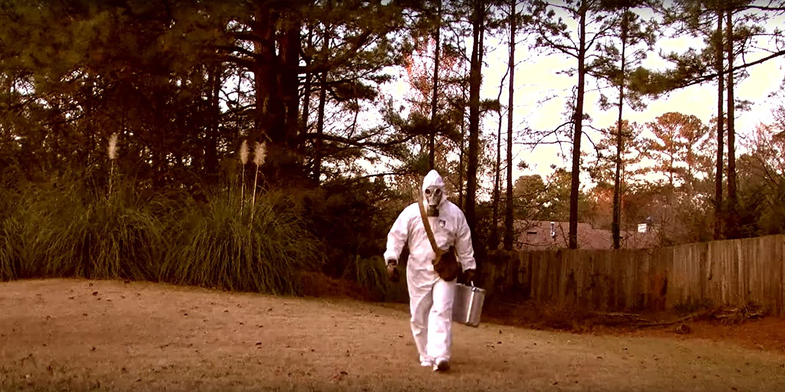

I'm a really important person. At least, you could be led to believe that by the sheer number of unsolicited sales emails I get on a weekly basis demanding my business. Calls, too, but who has the time—or the will, for that matter—to answer the phone?

Most sales emails sink to the bottom of my inbox and float back up again like dead fish in a tank, as the onslaught of drip campaigns churn along offering strategic partnership opportunities. Sometimes I archive these emails, only for them to reappear after a few days. Largely, I just look past them as they pile up, like so many unappetizing cans of beans in my pantry. (Why did I buy so many beans? I don't even like beans.)

Since the emergence of a novel coronavirus and the alarming creep of a global pandemic, everyday life has changed very fast. Our day to day has been whittled down to essential activities. We're working from home, under guidance or order to social distance and shelter in place to prevent the spread of COVID-19. We can't get toilet paper, for some reason. Science and medicine are scrambling to test, trace, and treat the disease and prevent an overload of the healthcare system. Entire industries and sectors of the economy are under threat, as millions stare down the specter of unemployment and hardship. What is happening is jarring and terrifying, full stop.

But one thing that hasn't abated is the cacophony of sales emails. In fact, it seems the pace of sales emails has been accelerating. And some SDRs are even using this global pandemic as a conversation starter to kick off new or recycled drip campaigns.

Each email seems to start out the same:

<blockquote><kbd>Hi Bill,  
I'm reaching out as I hope you and your family are staying safe, healthy, and sane in these challenging times. Our company is dedicated to continuing to provide our services in light of this unprecedented period.
  
Given the state of the world, I'd be keen to connect with you to chat about our revolutionary AI-driven marketing insights platform. Are you available tomorrow morning?</kbd></blockquote>

I'm sure that on an individual basis the concern and compassion in these messages could be real. But taken together, it looks trite and cavalier, like a churchgoer genuflecting absently on his way to get his free donut.

Then the drip campaign goes on, usually a thirsty 48 hours later:

<blockquote><kbd>Bill,
  
Just following up on my last email. Our end-to-end reporting automation solution is used by Fortune 5000 companies to enable scalable insights to ensure sustainable revenue growth.
  
Hope you're staying safe and healthy in these Challenging Times™️. What's a good time to connect?</kbd></blockquote>

A constant in these emails is the jargony euphemism for the pandemic. No one's saying "hey I hope you're doing okay with the shitty pandemic and everything". They're saying _Challenging Times_ or _Unprecendented Period_ or _State of the World_ like it was some BBC drama series and not a global health crisis.

As drip campaigns plod on, invoking the pandemic to feign relevance treads even further into the realm of tackiness:

<blockquote><kbd>Bill,
  
I trust you've received my last four emails, and that you and your family are staying safe and healthy in during this Unprecedented Period™️. Anyway, our vertically-enabled analytics tracking platform&hellip;</kbd></blockquote>

I have to give salesfolk credit, though. These people are facing sweeping job cuts across all industries, and they're in my inbox fighting for their livelihood. In that sense, seeing all their emails bobbing up and down in my inbox is a rhythm that lets me know they're still alive and kicking—even if all their emails ultimately go unanswered. If a drip campaign got cut short before the requisite four emails, I'd worry that one of my intrepid inbox invaders got canned. And that would make me a little sad, for a moment.

Seeing the dance of SDR spam in my inbox is a reminder that even when misery and tragedy are bearing down, the hustle doesn't stop, and in a sense, neither does the world. So here's to you, salescritter who's making pandemic-ade. Your unsolicited email makes me feel a little more normal, and your Always Be Closing attitude is making this bleak world a little brighter.

I'm pulling for you. But I'm not interested in your company's services at this time. I appreciate your understanding.

Regards, Bill
